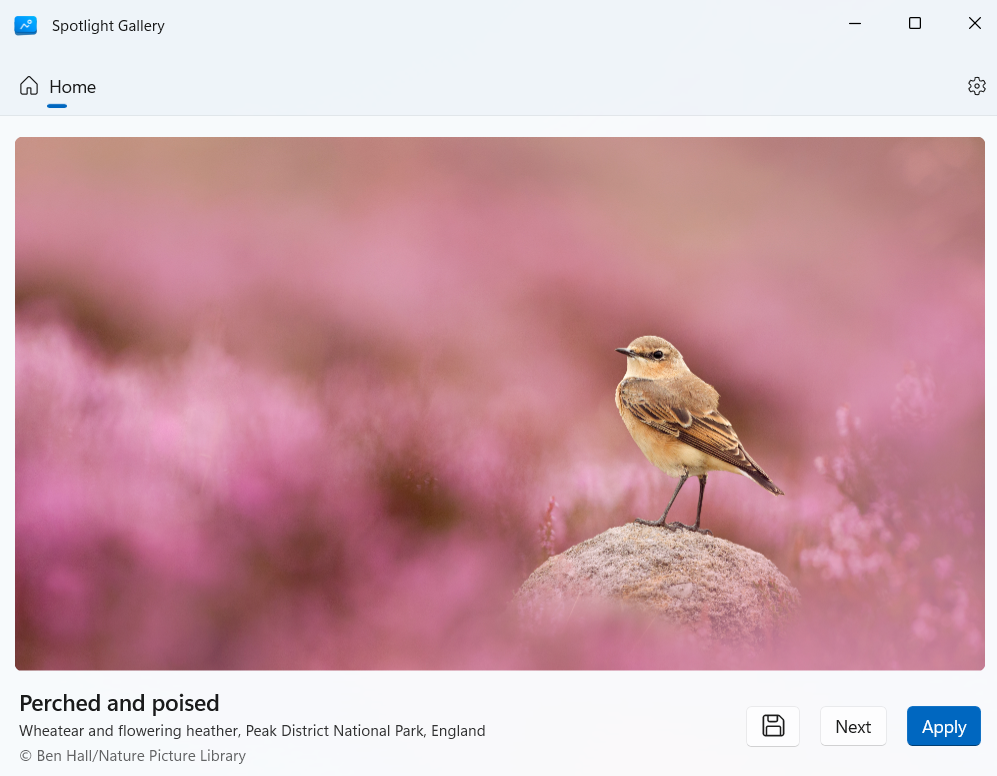
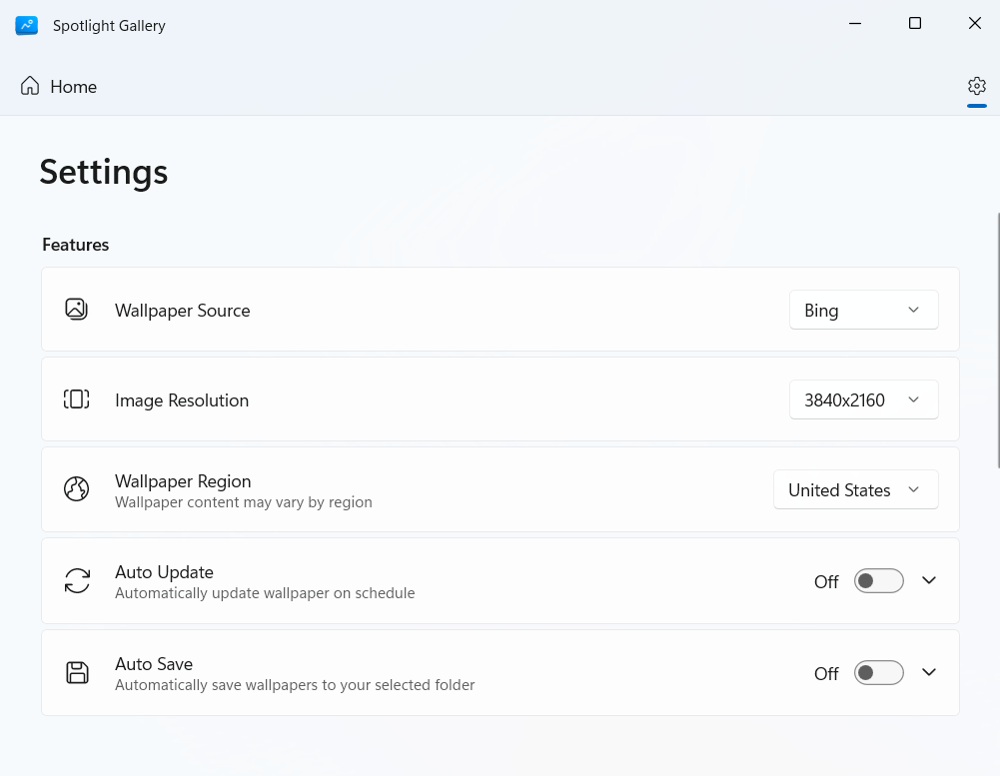

<p align="center">
    
</p>

<div align="center">

# SpotlightGallery

A clean Windows desktop wallpaper application

English | [中文](README_zh.md)

</div>

## Features

- **Multiple wallpaper sources**: Supports Windows Spotlight (desktop, lock screen) and Bing daily images
- **Multiple resolutions**: Various resolution options to fit different screen sizes
- **Region switching**: Freely switch between regional content to access special holiday and cultural wallpapers
- **Auto-update**: Automatically fetches and updates wallpapers daily
- **Auto-save**: Saves high-quality wallpapers locally for offline access
- **Clean interface**: Simple and intuitive user experience

## Installation

### System Requirements

Windows 10 or Windows 11 (recommended)

### Microsoft Store

Not yet available

### Sideload

1. Enable Developer Mode:

   **Windows 10**
   - Open `Settings` → `Update & Security` → `For developers`
   - Select `Developer mode` and confirm

   **Windows 11**
   - Open `Settings` → `System` → `For developers`
   - Turn on the `Developer Mode` toggle and confirm
   - Scroll down, expand the `PowerShell` section, and enable `Change execution policy...`

2. Download the latest release package from the [Releases](https://github.com/Qzincs/SpotlightGallery/releases) page
3. Extract the downloaded ZIP file
4. Run the installation script:
   - Right-click the `Install.ps1` script file and select `Run with PowerShell`
   - Follow the prompts to install the certificate and complete the app installation

**Notice:** When running the installation script, Windows may display warnings about the script being untrusted and the certificate being risky. The **untrusted script** warning is because PowerShell blocks running scripts downloaded from the internet by default; the **certificate risk** warning is because the app package uses a self-signed certificate for signing. Both are normal for sideload installations. If you have security concerns, consider building from source.

### Building from Source

1. Prerequisites:
   - Visual Studio 2022 (with WinUI app development workload)
   - Windows SDK (recommended 10.0.19041.0 or later)
   - .NET 8 SDK (recommended 8.0.100 or later)

2. Clone the repository:

   ```bash
   git clone https://github.com/Qzincs/SpotlightGallery.git
   ```

3. Open the `SpotlightGallery.sln` solution file

4. Click `Build` → `Deploy Solution`

## Screenshots





## Contributing

Feel free to submit Issues and Pull Requests!

---

If you find this project helpful, please consider giving it a Star ⭐
