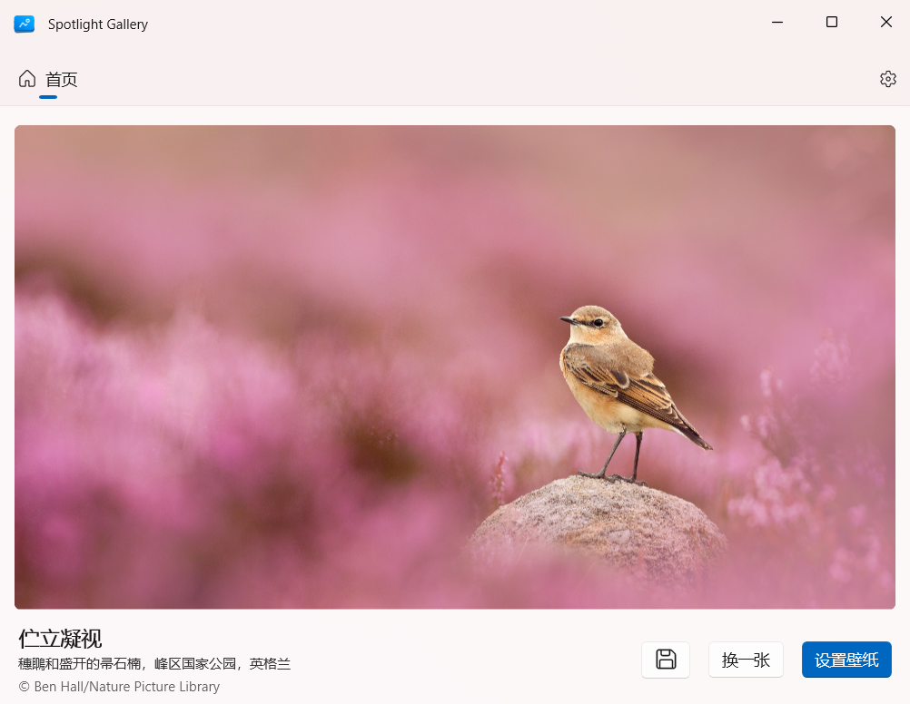
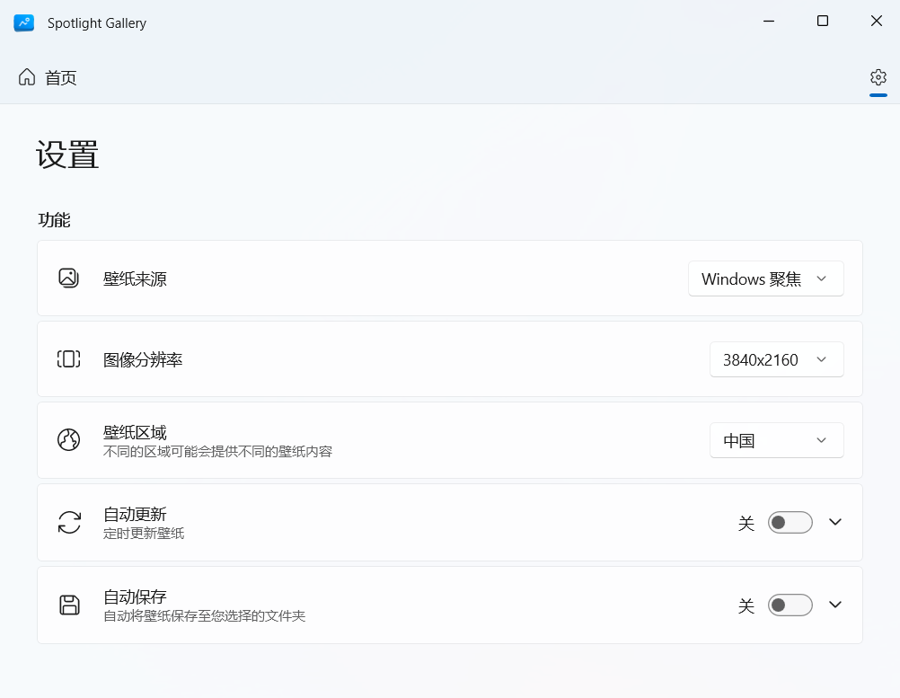

<p align="center">
    
</p>

<div align="center">

# SpotlightGallery

一款简洁的 Windows 桌面壁纸应用

[English](README.md) | 中文

</div>

## 功能

- **多壁纸源支持**：支持 Windows 聚焦桌面、锁屏和 Bing 每日一图
- **多分辨率选择**：提供多种分辨率选项，适配不同的屏幕尺寸
- **区域切换**：自由切换不同地区内容，获取特殊节日和文化主题壁纸
- **自动更新**：每日自动获取和更新壁纸
- **自动保存**：本地保存高清壁纸，支持离线访问
- **简洁界面**：简单直观的用户体验

## 安装

### 系统要求

Windows 10 或 Windows 11 (推荐)

### Microsoft Store

<a href="https://apps.microsoft.com/detail/9nb71rxt57xz?referrer=appbadge&mode=direct">
	
</a>

### 侧载

1. 开启开发者模式：

    **Windows 10**
    - 打开 `设置` → `更新和安全` → `开发者选项`；
    - 选择 `开发人员模式` 并确认。

    **Windows 11**
    - 打开 `设置` → `系统` → `开发者选项`；
    - 开启 `开发人员模式` 开关并确认；
    - 向下滚动，展开 `PowerShell` 部分，开启 `更改执行策略...` 选项。

2. 从 [Releases](https://github.com/Qzincs/SpotlightGallery/releases) 页面下载最新版本压缩包；
3. 解压下载的 ZIP 压缩包；
4. 运行安装脚本：
   - 右键点击 `Install.ps1` 脚本文件，选择 `使用 PowerShell 运行`；
   - 按照提示安装证书，完成应用安装。

**提示：** 在运行安装脚本时，系统可能会显示脚本不可信和安装证书有风险的警告。**脚本不可信**是因为 PowerShell 默认会阻止运行网络下载的脚本；**证书有风险**是因为应用包使用了自签名证书进行签名。这两种情况都是侧载安装的正常现象。如果对安全性有担忧，建议选择从源码构建的方式安装。

### 从源码构建

1. 先决条件：

   - Visual Studio 2022（包含 WinUI 应用程序开发工作负载）
   - Windows SDK（建议 10.0.19041.0 及以上）
   - .NET 8 SDK（建议 8.0.100 及以上）

2. 克隆项目仓库

    ```bash
    git clone https://github.com/Qzincs/SpotlightGallery.git
    ```

3. 打开 `SpotlightGallery.sln` 解决方案文件

4. 点击 `生成` → `部署解决方案`

## 应用截图





## 贡献

欢迎提交 Issue 和 Pull Request！

---

如果这个项目对你有帮助，请考虑给它一个 Star ⭐！
